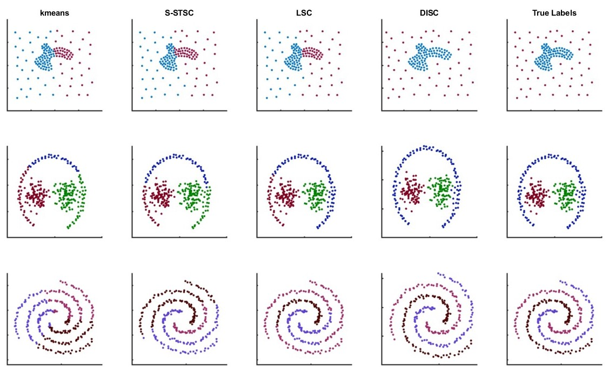
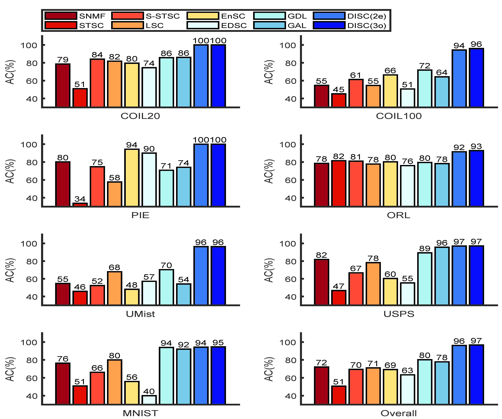

# Deep Intelligent Spectral Clustering
We present Deep Intelligent Spectral Clustering (DISC), a novel algorithm designed to address prevalent challenges in unsupervised data clustering. This is a repository of our method, implemented with MATLAB, as described in our paper (Zhang, Z. and Li, B). Zhang Zhenyue and Li Bingjie (bjlistat@nus.edu.sg) retain all copyrights of these codes.

In the folder "Data", there are some simulation and practical examples that can be used to test the DISC algorithm. In the folder "Tools", it contains DISC function files and other required functions. If you want to test the effect of DISC on a simulation example, you can run Demo_Simulation directly. If you want to test the effect of DISC on an actual example, you can run Demo_Images. 

<!-- -->

Figure 1. Performance of DISC and compared methods on 2D data sets with the class patterns: compounded, rounded, or spiraled.

Figure 2. Clustering accuracy AC (\%) of DISC and state-of-the-art non-network algorithms.

